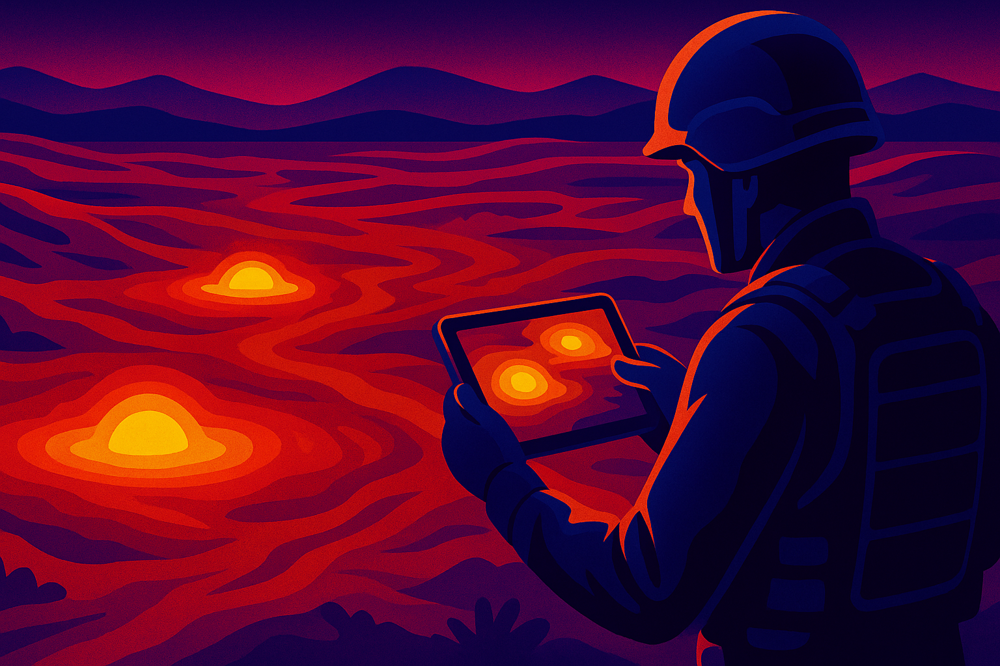

# Landmine Detection with Deep Learning Models using Aerial Thermal Imaging

[Jeison Guarguati](https://github.com/JeiGeek), [Diego Rodriguez](https://github.com/diego), [Guillermo Pinto](https://guillepinto.github.io/), [Hoover Rueda-Chacón](https://www.hfarueda.com/)

Research Group: [Hands-on Computer Vision](https://github.com/semilleroCV)

### [Paper](assets/docs/paper.pdf) | [Project Page](https://semillerocv.github.io/proyectos/equipo6)

> **Abstract:** We developed a landmine detection system based on deep learning using aerial thermal imagery from the public *Dataset of Thermographic Images for the Detection of Buried Landmines*. Our methodology combines image preprocessing and fine-tuning of state-of-the-art architectures, including ResNet, ConvNeXt, Vision Transformer (ViT), and Swin Transformer, for binary classification (mine / no-mine). Our best classifier achieved an accuracy of 99.23%, precision of 100%, sensitivity of 94.87%, and specificity of 100%, outperforming previous work. In addition, we manually annotated 360 images for object detection and trained YOLOv11, achieving 99.4% precision, 97.8% sensitivity, and 99.3% mAP\@50. This work demonstrates the potential of deep learning and thermal imaging in critical humanitarian security tasks, paving the way for robust automated solutions for landmine clearance.

 

**Overview:** Our approach integrates fine-tuning techniques using pretrained models on aerial thermal imagery for the detection of buried landmines. The project addresses both classification (mine / no mine) and object detection tasks, offering a strong baseline for future developments in automated humanitarian demining systems.

---

## Dataset

We used the *Dataset of Thermographic Images for the Detection of Buried Landmines*, which contains aerial thermal images of terrain with and without landmines. Each image includes thermal information captured under different environmental conditions. We manually annotated 360 images to enable object detection experiments and benchmarking.

You can explore the classification dataset [here](https://huggingface.co/datasets/JeiGeek/landmines_classification). And our object detection dataset here 

---

## Training and Evaluation

We conducted experiments in two stages:

### 1. Binary Classification

We fine tuned multiple deep learning models using Hugging Face and Weights & Biases and evaluated their performance on a test set.

### 2. Object Detection

We annotated a subset of 360 thermal images with bounding boxes and trained a YOLOv11 model to detect buried landmines.

All training followed standard protocols, including a weighted loss to handle class imbalance and hyperparameter optimization. Complete details are available in the [`notebooks/`](notebooks/) folder.

---

## Results

### Classification (mine / no-mine)

| Model                      | Accuracy   | Precision  | Sensitivity | Specificity |
| -------------------------- | ---------- | ---------- | ----------- | ----------- |
| Custom CNN (Edwards et al., 2024) | 0,9231     | --         | **0,9615**   | 0,6154        |
| ResNet-50                                | 0,8910     | 0,0000     | 0,0000       | 1,0000        |
| **ViT-B-16**                             | **0,9935** | **1,0000** | 0,9411       | **1,0000**    |
| ConvNeXt-T                               | 0,9807     | 1,0000     | 0,8235       | 1,0000        |
| Swin-T                                   | 0,9871     | 1,0000     | 0,8823       | 1,0000        |

### Object Detection

| Model                        | Precision | Recall | mAP\@50   | mAP\@50--95 | FPS     |
| ----------------------------- | --------- | ------------ | --------- | ----------- | ------- |
| YOLOv8 (Edwards et al., 2024) | 0,911     | 0,410        | ---       | ---         | ---     |
| **YOLOv11m**                  | **0,994** | **0,978**    | **0,993** | **0,835**   | **125** |
| YOLOv8m                       | 0,936     | 0,899        | 0,935     | 0,548       | 35,6    |

---

## Checkpoints

Pretrained models and checkpoints can be found [here](https://huggingface.co/datasets/JeiGeek/landmines_classification). And our trained Yolov11 for mine detection [here](https://) 

---

## Acknowledgements

We thank the creators of the [Thermal Landmine Dataset](https://www.sciencedirect.com/science/article/pii/S2352340923005437) and acknowledge prior methodologies such as the work of [Edwards et al. (2024)](https://ieeexplore.ieee.org/abstract/document/10746152) and [Forero-Ramírez et al. (2022)](https://www.sciencedirect.com/science/article/pii/S1350449522002882). This research was supported by the Hands-on Computer Vision group at Universidad Industrial de Santander.

---

## License

This project is licensed under the MIT License. See the [LICENSE](LICENSE) file for details.

---

## Contact

For questions or feedback, please reach out to the research group at: `contact@cv-research.org`